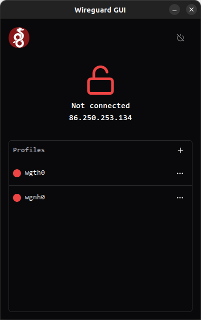

<div align="center">
  <h1>Wireguard GUI</h1>
  <h3>❤️ Made with love with Nextauri ❤️</h3>

<p>

[](https://github.com/0xle0ne/wireguard-gui)
[](https://github.com/0xle0ne/wireguard-gui)
[](https://github.com/0xle0ne/wireguard-gui)
[](https://discord.gg/WV4Aac8uZg)

</p>

<p>

[](https://github.com/0xle0ne/wireguard-gui/actions/workflows/eslint_clippy.yml)
[](https://github.com/0xle0ne/wireguard-gui/actions/workflows/build.yml)

</p>

<p>

[](https://snapcraft.io/wireguard-gui)

</p>

<p>

[](https://github.com/0xle0ne/wireguard-gui/releases/latest)

</p>



</div>

## What is Wireguard GUI ?

Wireguard GUI is a Linux application that allow you to manage your Wireguard VPN configuration.

## Features

- [x] List all profile
- [x] Add a new profile
- [x] Edit a profile
- [x] Remove a profile
- [x] Start a profile
- [x] Stop a profile
- [x] Import a profile
- [x] Export a profile

## Motivation

I didn't found any GUI application that allow me to manage my Wireguard VPN configuration. <br />
I wanted to make an application with nextauri since a while, so i took this opportunity to make it.

## Pre-requisites

In order to work properly, the application needs the following dependencies:

```sh
sudo apt-get install javascriptcoregtk-4.1 libsoup-3.0 webkit2gtk-4.1 libayatana-appindicator3-dev librsvg2-dev wireguard resolvconf -y
```

## Installation

#### Install from [Releases](https://github.com/0xle0ne/wireguard-gui/releases/latest):
Release are currently available as .deb package for Debian/Ubuntu or Appimage for others distro.

#### Install from [AUR](https://aur.archlinux.org/packages/wireguard-gui-bin):

```sh
yay -S wireguard-gui-bin
```

## Developing

Be sure you have [NodeJS](https://nodejs.org/en/) and [Rust](https://www.rust-lang.org/) installed on your system

1.  See Tauri [prerequisites](https://tauri.app/v1/guides/getting-started/prerequisites/) to prepare your system to build `Tauri`

2.  Clone or fork this repository
    ```sh
    git clone https://github.com/0xle0ne/wireguard-gui
    cd wireguard-gui
    ```
3.  Install node dependencies
    ```sh
    npm install
    ```

To get started you only need one command

```sh
npm run dev
```

## Production

To build in production you can do it in a single command.
This will build and export Next.js and build Tauri for your current environnement.

```sh
npm run tauri build
```

## Documentation

To learn more about Tauri and Next.js, take a look at the following resources:

- [Tauri Guides](https://tauri.app/v1/guides/) - guide about Tauri.
- [Tauri API](https://tauri.app/v1/api/js) - discover javascript Tauri api.
- [Next.js Documentation](https://nextjs.org/docs) - learn more about Next.js.
- [Next.js Tutorial](https://nextjs.org/learn) - interactive Next.js tutorial.


## Troubleshooting

### Error: NetworkManager is not running.

You need to connect the snap to network manager

```sh
sudo snap connect wireguard-gui:network-manager :network-manager
```
